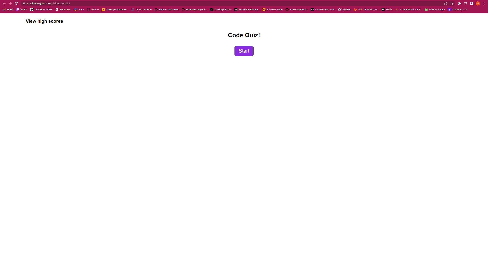

# Module 4: Web APIs Challenge: Code Quiz

## Description

This website is a short quiz. The player will be asked a series of questions set to a timer. The player will be notified whether they answered each question accurately. The player will log their initials and score at the end of the game. This website offers a gameified way to review coding concepts.

## Installation

N/A

## Usage

Navigate to website and click the start button. The timer will begin to count down from 20 seconds and the player will be asked 5 true/false questions. The player will be notified whether the answer they chose was correct for each question. For each incorrect answer, the player will lose a second on the timer. If the player fails to answer all of the questions in the allotted time, a message will display telling the player to refresh the page and try again. If the player successfully answers all the questions in the allotted time, they will be able to log their name and score to the scoreboard.

url: https://mahlheim.github.io/jubilant-doodle/

    

## License

Please refer to the license in the repo.